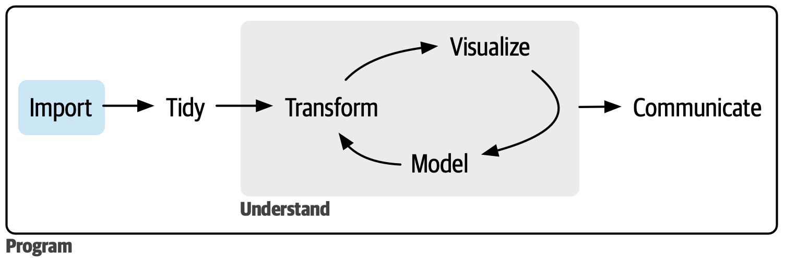
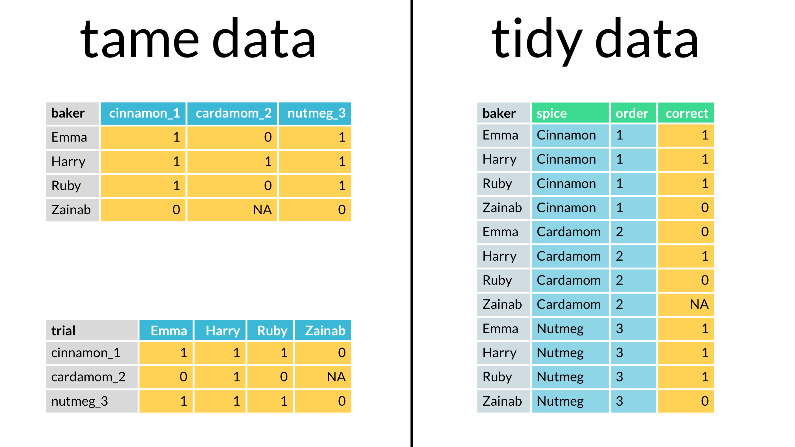
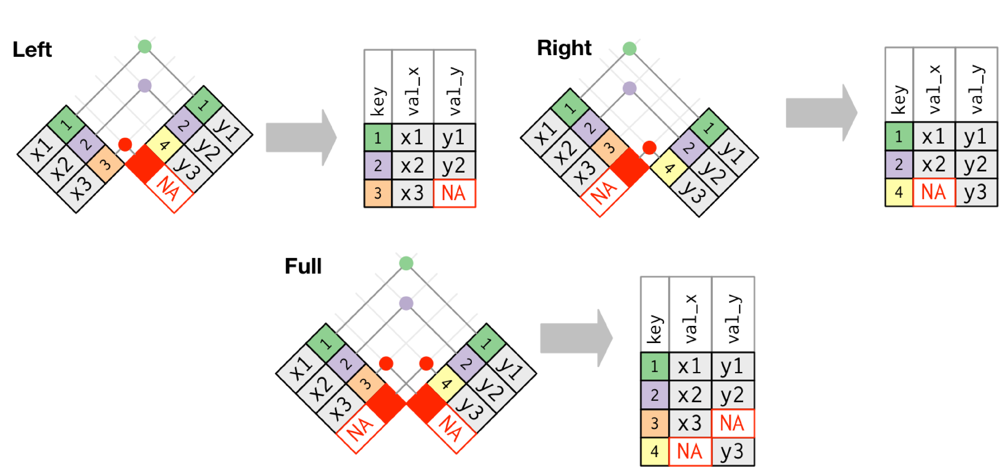
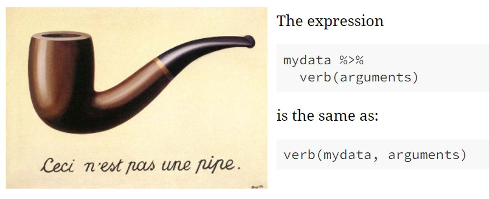

```{r setup, include=FALSE}
knitr::opts_chunk$set(echo = TRUE)
library(dplyr)
```

## Series On: Data Wrangling and Visualization in R

## Session 1: Importing Data, Data Wrangling, and Tidy Data



# Objectives of today's session

1.  Learn how to import raw data in R.

2.  Creat tidy dataset from raw data using `tidyr`.

3.  Use `dplyr` package for data transformation.

------------------------------------------------------------------------

# R is a simple calculator

| Operator | Description                 |
|----------|-----------------------------|
| **+**    | Addition                    |
| **-**    | Subtraction                 |
| **\***   | Multiplication              |
| **/**    | Division                    |
| **\^**   | Exponentiation (Power)      |
| **%%**   | Modulus (Remainder)         |
| **%/%**  | Integer Division (Quotient) |

```{r}
398 + 783

600 / 5

45 * 45
```

### [**Exercise:1**]{style="color:coral"}

[1. Try doing following calculation using math operators]{style="color:coral;"}

$$
\frac{1+5^{1/2}} {2}
$$

```{r}
# Your code here

```

[2. Find modulus of 5 divided by 2]{style="color:coral"}

```{r}
# Your code here

```

------------------------------------------------------------------------

# R scripts write, organize, and execute code in the R

create a new script file (File \> New File \> R Script)

```{r}
## Copy this code in the R script

# Assigning numbers to variables
a <- 5
b <- 3

# Addition
sum_result <- a + b

# Subtraction
diff_result <- a - b

# Print the results
print("Results of Basic Math Operations:")
print(paste("Sum: ", sum_result))
print(paste("Difference: ", diff_result))
```

# Data Types and Objects in R


```{r}
num_variable <- 42.5
class(num_variable)
```

```{r}
char_variable = "Welcome to the DS club"
class(char_variable)
```

```{r}
logic_variable = TRUE
class(logic_variable)
```

```{r}
num_variable == 42.5
num_variable >= 50
class(num_variable == 42.5)
```

## Non Atomic R Objects


How do we create a vector.

```{r}
numeric_vector_1 <- c(1, 2, 3, 4, 5)

numeric_vector_2 <- 1:5
```

Accessing elements of a numeric vector

```{r}
numeric_vector_1[3] # Access the third element of the vector

numeric_vector_1[2:3] # Access the second to third element of the vector

numeric_vector_1[c(2,5)] # Access the second and fifth element of the vector
```

Data Frames are important R objects. We will learn how to create a dataframe later in this session.

### [**Exercise:3**]{style="color:coral"}

[1. Create a vector of odd numbers till 10 and access numbers greater than 5]{style="color:coral;"}

```{r}
# Your code here

```

# Functions: Block of reusable code that performs a tasks

3 Key Properties of an R function.

-   functions have a name and they are case sensetive

-   following the name they have a pair of ()

-   inside (), function take 0 or more arguments


```{r}
summ_two_numbers <- function(a=3, b=6){
  return(a+b)
}

summ_two_numbers()
summ_two_numbers(5, 19)
```

### [**Exercise:2**]{style="color:coral"}

[Complete this code to return square of 9]{style="color:coral"}

```{r eval=FALSE, include=TRUE}
# Your code here
squared_num <- function(x){
   squared = ___
   return(___)
 }
 
 squared_num(9)
```

------------------------------------------------------------------------

# Read tables in R

Need help looking at the many arguments of `read.table` you can use? It's easy.

**Type this on the console:** `?read.table`

Don't know what your file looks like? No issue. We can check by reading the file line by line. This works even when the file size in GBs and we don't have a software to open the file on our operating system.

```{r}
# Specify the path to your file
file_path1 <- "Datasets/file_1_to_read.txt"

# Read the first few lines
readLines(file_path1, n = 5)
```

*Note: You can not create a R dataframe and perform data analysis by reading a file line by line.*

```{r}
df1 = read.table(file_path1, sep="\t", header = TRUE)
```

To check if your data was properly read

```{r}
df1

head(df1) # Another way to check a long table (Prints top 6 rows)
```

### [**Exercise 4**]{style="color:coral"}

```{r}
# Specify the path to your file
file_path2 <- "Datasets/file_2_to_read.txt"
```

[1. Try figuring out what are the best arguments to read the second file]{style="color:coral;"}

```{r eval=FALSE, include=TRUE}
# Hint: Read the first few lines
readLines(,)
```

[2. Now use read.table function to create the df2]{style="color:coral;"}

```{r eval=FALSE, include=TRUE}
# Complete the code
df2 = read.table(file_path2, , )

df2
```

# Installing and Loading Libraries

All packages are installed in this environment.

If you will use RStudio on your own machine you will have to install packages before you can install using the following command.

```{r eval=FALSE, include=TRUE}
install.packages("dplyr")
```

To load a library in your environment, use the `library` command.

```{r}
library(readr)
read_csv("Datasets/file_3_to_read.csv", col_select = c(1:4))
```

```{r}
read_csv("Datasets/file_3_to_read.csv", col_select = c(4:9))
```

```{r}
library(readxl)
read_xlsx("Datasets/file_4_to_read.xlsx", sheet = 'Sheet1')
```

------------------------------------------------------------------------

# Tidying data with `tidyr` package

**Tidy data** is a standard way of **mapping** the **meaning** of a dataset to its **structure**.




### [**Exercise 5**]{style="color:coral"}

[1. load `tidyr` package]{style="color:coral"}

```{r eval=FALSE, include=TRUE}
# Complete the following code

library(_ _ _)

```

[2. load `dplyr` package]{style="color:coral"}

```{r}
# Write the line to load dplyr package

```

## Split and Merge Messy Data

```{r}
# Let's create sample dataframe and look at some tidyr functions to merge and split data

splicing_data <- data.frame(
  Event_ID = c('ENSG1_AB', 
               'ENSG2_CD', 
               'ENSG3_EF', 
               'ENSG4_GH',
               'ENSG5_IJ'),
  PSI_value_1 = as.character(c('0.', '0.', '0.', '0.', '1.')),
  PSI_value_2 = as.character(c(1,2,3,4,0)),
  Group = c("A", "B", "B", "A", "A"), 
  Peak = c('NA', 5, "NA", 9, 'NA')
)

splicing_data
```

```{r}
tidy_splicing_data <- tidyr::unite(splicing_data, PSI_value_1, PSI_value_2, col="PSI_value", sep="", remove=TRUE)

tidy_splicing_data

# return new dataframe with new defined column
# also we can remove old columns or retain them
# you could play with "sep" and "col" arguments
```

```{r}
# tidyr::separate same as tidyr::separate_wider_delim
tidyr::separate(tidy_splicing_data, Event_ID, sep="_", into=c('ID', 'Splicing event'), remove=TRUE)
```

### [**Exercise 6**]{style="color:coral"}

[Work with another dataset]{style="color:coral"}.

[1. Import the data into R.]{style="color:coral"}.

*Hint: Its a Tab Separated file*

```{r eval=FALSE, include=TRUE}
# Complete the code here
path <- "Datasets/gff_file.txt"
df3 <- read.table(path, )
```

[2. Select column `c(1,3,4,5, and 9)`]{style="color:coral"}.

*Hint: Check Base R cheat sheet*

```{r eval=FALSE, include=TRUE}
# Your the code here
```

[3. Separate column 9 by `sep=";"` and remove the last two columns]{style="color:coral"}.

*Hint: Its the same as selecting the first 5 columns*

```{r eval=FALSE, include=TRUE}
# Complete the code here
tidyr::select(df3, )
```

# Reshape data with `tidyr`


```{r}
# First of all, let's create sample dataframe.

table2 <- data.frame(
  country = c("A", "A", "B", "B", "C", "C"),
  year = c(1999, 2000, 1999, 2000, 1999, 2000),
  cases = c("0.7K", "2K", "37K", "80K", "212K", "213K"),
  pop = c("19M", "20M", "172M", "174M", "1T", "1T")
)

table2
```

```{r}
# Let's reshape it
tidyr::pivot_longer(table2, cols = c("cases","pop"), names_to = "type", values_to = "count")
```

# Transforming with `dplyr`

| dplyr Verb | What it Does                                     |
|------------|--------------------------------------------------|
| `filter`   | Retrieve rows based on specified values.         |
| `select`   | Retrieve columns based on specified names.       |
| `mutate`   | Add new variables to the data frame.             |
| `arrange`  | Change the order of the rows based on variables. |

Let’s look at how those work.

```{r}
table2
```

In our table the cases is a character data type. To perform any mathematical operations or comparisons. We must mutate this into an appropriate double.

```{r}
table3 <- mutate(table2, cases = as.double(sub("K", "", cases))*1000)

table3
```

Now we can use filter to look for countries that have more than 3000 cases in 1999.

```{r}
filter(table3, cases > 3000 & year == 1999)
```

### [**Exercise 7**]{style="color:coral"}

[1. Filter all the rows from year 2000 from `table3`]{style="color:coral"}

```{r eval=FALSE, include=TRUE}
# complete the code
- - - (table3, _ _ _)
```

```{r}
select(table3, country, year, cases)
```

```{r}
arrange(table3, year)
```

# Join and Summarise with `dplyr`

Return back to our splicing data, and join it to another dataframe with new Attribute2, but new dataframe has information only for 4 Events

What to do??? ---\> left and right joins

```{r}

new_splicing_data <- mutate(tidy_splicing_data, PSI_value = as.numeric(PSI_value))

new_splicing_data

```

```{r}
splicing_data_count = data.frame(
  Event_ID = c('ENSG1_AB', 'ENSG2_CD', 'ENSG3_EF', 'ENSG4_GH'),
  count = c(43, 54, 72, 26))
splicing_data_count
```



### dplyr::left_join

```{r}
dplyr::left_join(new_splicing_data, splicing_data_count, by="Event_ID")
```

### dplyr::right_join

```{r}
dplyr::right_join(new_splicing_data, splicing_data_count, by="Event_ID")
```

# The Power of `%>%` (Pipe Operator)

Revolutionize your coding style with the **`%>%`** operator.

{width="428"}

```{r}
new_splicing_data %>% select(Event_ID)
```

### dplyr::mutate()

```{r}
# Transform data in dataframe
new_splicing_data %>% mutate(new_PSI_value = 10*PSI_value)
```

### dplyr::filter()

```{r}
new_splicing_data %>% filter(PSI_value > 0.2)
```

| dplyr Verb  | What it Does                                   |
|-------------|------------------------------------------------|
| `group_by`  | groups the data based on the specified column. |
| `summarize` | Compute summary statistics for the data.       |

### dplyr::group_by() & dplyr::summarise()

```{r}
new_splicing_data %>% 
  group_by(Group) %>%
  summarise(
    mean_value = mean(PSI_value)
  )
```

# Write data

```{r}
write.csv(new_splicing_data, 'new_splicing_data.csv')
```

# Real World Problem for Self Learning

Join our coding challenge! Craft the most **well-structured**, **reproducible**, and **readable code** for analyzing qPCR data using tidyverse packages. Your winning code will be showcased with a shout-out on Slack, and you'll receive an exciting prize in the next session.

Submission till March 2

cq_values.csv table contains well-specific quantification values (Cq) from qPCR

```{r echo=FALSE}
path_cq <- "Datasets/cq_values.csv"
path_plate <- "Datasets/plate_view.csv"

df_cq <- read.csv(path_cq)
df_plate <- read.csv(path_plate)

head(df_cq)
```
plate_view.csv table provides corresponding information about genes and samples associated with each well
```{r}
head(df_plate)
```

The df_cq table contains well-specific quantification values (Cq) from qPCR, while the df_quant table provides corresponding information about genes and samples associated with each well. The goal is to clean and process this data to generate a tidy table that presents the quantification values for each gene and sample as replicates. Additionally, calculate the mean Cq for each gene and sample. The analysis and code should be structured, clean, and reproducible, utilizing the tidyverse approach for optimal data manipulation and summarization.
